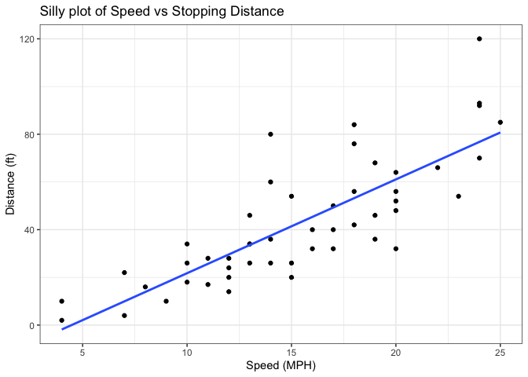
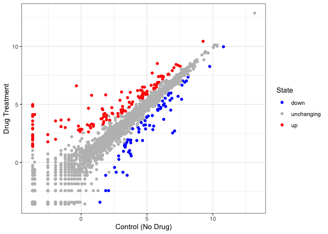
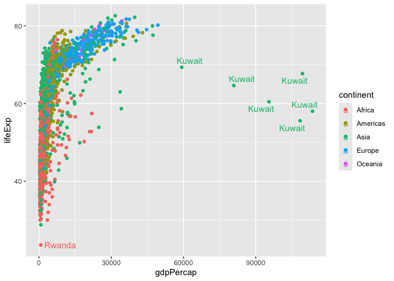

# Class_05: Data Viz with ggplot
Dan Vu (PID: A17380158)

Today we are exploring the **ggplot** package and how to make nice
figures in R.

There are lots of ways to make figures and plots in R. These include:

- so called “base” R
- and add on packages like **ggplot2**

Here is a simple “base” R plot.

``` r
head(cars)
```

      speed dist
    1     4    2
    2     4   10
    3     7    4
    4     7   22
    5     8   16
    6     9   10

We can simply pass it to the `plot()` function.

``` r
plot(cars)
```


> Key-point: Base R is quick but not so nice looking in some folks eyes.

Let’s see how we can plot this with **ggplot2**…

1st I need to instal this add-on package. For this we use the
`install.packages()` function - **WE DO THIS IN THE CONSOLE, NOT our
report** This is a one time only deal.

2nd We need to load the package with `library()` function every time we
want to use it.

``` r
library(ggplot2)
ggplot(cars)
```


Every ggplot is composed of at least 3 layers:

\-**data** (i.e a data.frame with the things you want to plot),
-aesthetics **aes()** that map the columns of data to your plot features
(i.e aesthetics) - geoms like **geom_point()** that sort how the plot
appears

``` r
ggplot(cars) +
  aes(x=speed, y=dist) +
  geom_point()
```


``` r
hist(cars$speed)
```


> Key point: For simple “canned” graphs base R is quicker and more
> concise to write the code, but as things get more custom and elaborate
> then ggplot wins out…

Let’s add more layers to our ggplot

Add a line showing the relationship between x and y. Add a title Add
custom axis labels “Speed (MPH)” and “Distance (ft)” Change the theme…

``` r
ggplot(cars) +
  aes(x=speed, y=dist) +
  geom_point() +
  geom_smooth(method="lm", se=FALSE) +
  labs(title = "Silly plot of Speed vs Stopping Distance") +
  labs(x="Speed (MPH)", y="Distance (ft)")+
  theme_bw()
```

    `geom_smooth()` using formula = 'y ~ x'



## Going further

Read some gene expression data

``` r
url <- "https://bioboot.github.io/bimm143_S20/class-material/up_down_expression.txt"
genes <- read.delim(url)
head(genes)
```

            Gene Condition1 Condition2      State
    1      A4GNT -3.6808610 -3.4401355 unchanging
    2       AAAS  4.5479580  4.3864126 unchanging
    3      AASDH  3.7190695  3.4787276 unchanging
    4       AATF  5.0784720  5.0151916 unchanging
    5       AATK  0.4711421  0.5598642 unchanging
    6 AB015752.4 -3.6808610 -3.5921390 unchanging

> Q1. How many genes are in this dataset?

``` r
nrow(genes)
```

    [1] 5196

> Q2. How many “up” regulated genes are there?

``` r
sum(genes$State=="up")
```

    [1] 127

A useful function for counting up occurences of things in a vector is
the `table()` function.

``` r
table(genes$State)
```


          down unchanging         up 
            72       4997        127 

Make a v1 figure

``` r
p <- ggplot(genes) +
  aes(x=Condition1, y=Condition2, col=State) +
  geom_point()
```

``` r
p + 
  scale_color_manual(values=c("blue","gray","red"))+
  labs(x = "Control (No Drug)", y = "Drug Treatment") +
  theme_bw()
```



## More Plotting

``` r
url <- "https://raw.githubusercontent.com/jennybc/gapminder/master/inst/extdata/gapminder.tsv"

gapminder <- read.delim(url)
```

``` r
head(gapminder, 3)
```

          country continent year lifeExp      pop gdpPercap
    1 Afghanistan      Asia 1952  28.801  8425333  779.4453
    2 Afghanistan      Asia 1957  30.332  9240934  820.8530
    3 Afghanistan      Asia 1962  31.997 10267083  853.1007

> Q4. How many different country values are in this dataset?

``` r
length(table(gapminder$country))
```

    [1] 142

``` r
unique(gapminder$continent)
```

    [1] "Asia"     "Europe"   "Africa"   "Americas" "Oceania" 

``` r
ggplot(gapminder) +
  aes(x=gdpPercap, y=lifeExp, col=continent) +
  geom_point()
```


``` r
ggplot(gapminder) +
  aes(x=gdpPercap, y=lifeExp, col=continent, label=country) +
  geom_point() +
  geom_text()
```


I can use the **ggrepl** package to make more sensible labels here.

``` r
library(ggrepel) 
ggplot(gapminder) +
  aes(x=gdpPercap, y=lifeExp, col=continent, label=country) +
  geom_point() +
  geom_text_repel()
```

    Warning: ggrepel: 1697 unlabeled data points (too many overlaps). Consider
    increasing max.overlaps



``` r
ggplot(gapminder) +
  aes(x=gdpPercap, y=lifeExp, col=continent, label=continent) +
  geom_point() +
  facet_wrap(~continent)
```


\##Summary

ggplot2 offers several advantages over base R plots:

1.  **Layered Grammar**: ggplot uses a consistent, layered
    approach—data, aesthetics, and geometric layers—making complex plots
    easier to build and customize step by step
    [\[1\]](https://drive.google.com/file/d/1BYSWJLROqxA1YpuDhJkzUolhiZqiOOKg/view?usp=drivesdk),
    [\[2\]](https://drive.google.com/file/d/1tFqKg9_nhVMmKYfiM1CQKDS2PmPwLh8n/view?usp=drivesdk),
    [\[3\]](https://drive.google.com/file/d/1Clw2_EJ_hY3USNwObiPnxpIQIfirxfW0/view?usp=drivesdk),
    [\[5\]](https://drive.google.com/file/d/15xXaaIcCWOc_x1gJLdySWOd_sfMXTiaw/view?usp=drivesdk),
    [\[4\]](https://drive.google.com/file/d/1FDBbIi2Rlw2In9mClB7Mub8oUPgx6y8h/view?usp=drivesdk).

2.  **Publication Quality**: ggplot produces attractive,
    publication-ready figures with sensible defaults, which are often
    more visually appealing than base R plots
    [\[1\]](https://drive.google.com/file/d/1BYSWJLROqxA1YpuDhJkzUolhiZqiOOKg/view?usp=drivesdk),
    [\[2\]](https://drive.google.com/file/d/1tFqKg9_nhVMmKYfiM1CQKDS2PmPwLh8n/view?usp=drivesdk),
    [\[3\]](https://drive.google.com/file/d/1Clw2_EJ_hY3USNwObiPnxpIQIfirxfW0/view?usp=drivesdk),
    [\[4\]](https://drive.google.com/file/d/1FDBbIi2Rlw2In9mClB7Mub8oUPgx6y8h/view?usp=drivesdk).

3.  **Customization**: While base R gives pixel-level control, ggplot
    makes it easier to add customizations (like colors, labels, themes)
    and combine multiple elements in a single plot
    [\[1\]](https://drive.google.com/file/d/1BYSWJLROqxA1YpuDhJkzUolhiZqiOOKg/view?usp=drivesdk),
    [\[2\]](https://drive.google.com/file/d/1tFqKg9_nhVMmKYfiM1CQKDS2PmPwLh8n/view?usp=drivesdk),
    [\[3\]](https://drive.google.com/file/d/1Clw2_EJ_hY3USNwObiPnxpIQIfirxfW0/view?usp=drivesdk),
    [\[5\]](https://drive.google.com/file/d/15xXaaIcCWOc_x1gJLdySWOd_sfMXTiaw/view?usp=drivesdk),
    [\[4\]](https://drive.google.com/file/d/1FDBbIi2Rlw2In9mClB7Mub8oUPgx6y8h/view?usp=drivesdk).

4.  **Consistency**: The same building blocks (data, aesthetics, geoms)
    apply to all plot types, reducing the need to learn different
    functions for each plot style as in base R
    [\[1\]](https://drive.google.com/file/d/1BYSWJLROqxA1YpuDhJkzUolhiZqiOOKg/view?usp=drivesdk),
    [\[2\]](https://drive.google.com/file/d/1tFqKg9_nhVMmKYfiM1CQKDS2PmPwLh8n/view?usp=drivesdk),
    [\[3\]](https://drive.google.com/file/d/1Clw2_EJ_hY3USNwObiPnxpIQIfirxfW0/view?usp=drivesdk),
    [\[5\]](https://drive.google.com/file/d/15xXaaIcCWOc_x1gJLdySWOd_sfMXTiaw/view?usp=drivesdk),
    [\[4\]](https://drive.google.com/file/d/1FDBbIi2Rlw2In9mClB7Mub8oUPgx6y8h/view?usp=drivesdk).

5.  **Scalability**: For simple plots, base R is quick, but ggplot is
    more concise and manageable for complex, multi-layered figures
    [\[1\]](https://drive.google.com/file/d/1BYSWJLROqxA1YpuDhJkzUolhiZqiOOKg/view?usp=drivesdk),
    [\[2\]](https://drive.google.com/file/d/1tFqKg9_nhVMmKYfiM1CQKDS2PmPwLh8n/view?usp=drivesdk),
    [\[3\]](https://drive.google.com/file/d/1Clw2_EJ_hY3USNwObiPnxpIQIfirxfW0/view?usp=drivesdk),
    [\[5\]](https://drive.google.com/file/d/15xXaaIcCWOc_x1gJLdySWOd_sfMXTiaw/view?usp=drivesdk),
    [\[4\]](https://drive.google.com/file/d/1FDBbIi2Rlw2In9mClB7Mub8oUPgx6y8h/view?usp=drivesdk).
