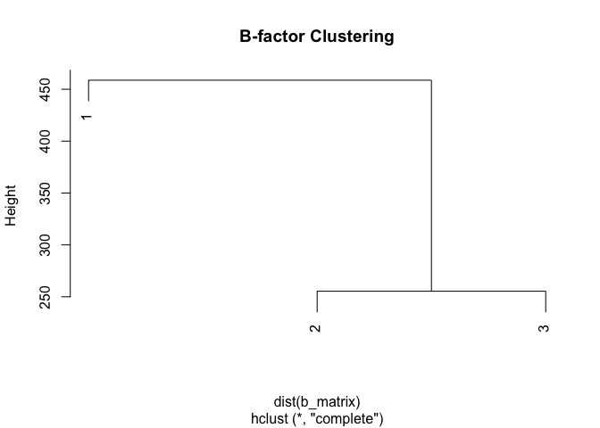

# R Functions Lab (Class 06)
Dan Vu (PID: A17380158)

``` r
library(bio3d)
s1 <- read.pdb("4AKE") # kinase with drug
```

      Note: Accessing on-line PDB file

``` r
s2 <- read.pdb("1AKE") # kinase no drug
```

      Note: Accessing on-line PDB file
       PDB has ALT records, taking A only, rm.alt=TRUE

``` r
s3 <- read.pdb("1E4Y") # kinase with drug
```

      Note: Accessing on-line PDB file

``` r
s1.chainA <- trim.pdb(s1, chain="A", elety="CA")
s2.chainA <- trim.pdb(s2, chain="A", elety="CA")
s3.chainA <- trim.pdb(s3, chain="A", elety="CA")
s1.b <- s1.chainA$atom$b
s2.b <- s2.chainA$atom$b
s3.b <- s3.chainA$atom$b
plotb3(s1.b, sse=s1.chainA, typ="l", ylab="Bfactor")
```


``` r
plotb3(s2.b, sse=s2.chainA, typ="l", ylab="Bfactor")
```


``` r
plotb3(s3.b, sse=s3.chainA, typ="l", ylab="Bfactor")
```


``` r
#' Analyze Protein B-factors and Cluster Similarity
#'
#' This function reads a set of protein structures (PDB IDs or file paths), extracts B-factors for a specified chain and atom type,
#' and produces a dendrogram plot showing similarity between the proteins.
#'
#' @param pdb_ids Vector of PDB IDs or file paths to protein structures.
#' @param chain Chain identifier to analyze (default "A").
#' @param atom_type Atom type to extract (default "CA").
#'
#' @return Dendrogram plot of B-factor similarity. Invisibly returns the clustering object.
#'
#' @examples
#' analyze_protein_bfactors(c("4AKE", "1AKE", "1E4Y"))
#'
#' # This will plot a dendrogram comparing the B-factor profiles of the three proteins.
analyze_protein_bfactors <- function(pdb_ids, chain="A", atom_type="CA") {
  # Inputs:
  #   pdb_ids: vector of PDB IDs or file paths to protein structures
  #   chain: chain identifier to analyze (default "A")
  #   atom_type: atom type to extract (default "CA")
  # What the function does:
  #   Reads each protein structure, extracts B-factors for the specified chain and atom type,
  #   and clusters the B-factor profiles, producing a dendrogram plot.
  # Output:
  #   Dendrogram plot of B-factor similarity. Invisibly returns the clustering object.
  library(bio3d)
  b_factors <- lapply(pdb_ids, function(id) {
    pdb <- read.pdb(id)
    chain_trim <- trim.pdb(pdb, chain=chain, elety=atom_type)
    chain_trim$atom$b
  })
  b_matrix <- do.call(rbind, b_factors)
  hc <- hclust(dist(b_matrix))
  plot(hc, main="B-factor Clustering")
  invisible(hc)
}
```

``` r
analyze_protein_bfactors(c("4AKE", "1AKE", "1E4Y"))
```

      Note: Accessing on-line PDB file

    Warning in get.pdb(file, path = tempdir(), verbose = FALSE):
    /var/folders/g9/y7cjmdfs4s7c5cfhmlh7_3sc0000gn/T//RtmptTOPSH/4AKE.pdb exists.
    Skipping download

      Note: Accessing on-line PDB file

    Warning in get.pdb(file, path = tempdir(), verbose = FALSE):
    /var/folders/g9/y7cjmdfs4s7c5cfhmlh7_3sc0000gn/T//RtmptTOPSH/1AKE.pdb exists.
    Skipping download

       PDB has ALT records, taking A only, rm.alt=TRUE
      Note: Accessing on-line PDB file

    Warning in get.pdb(file, path = tempdir(), verbose = FALSE):
    /var/folders/g9/y7cjmdfs4s7c5cfhmlh7_3sc0000gn/T//RtmptTOPSH/1E4Y.pdb exists.
    Skipping download


