# Class 7: Machine Learning 1
Dan Vu (PID: A17380158

Today we will explore some fundamental machine learning methods
including clustering and dimensionality reduction.

## K-means clustering

To see how this works let’s first makeup some data to cluster where we
know what the answer should be. We can use `rnorm()` function to help
here:

``` r
x <- c(rnorm(30, mean = -3), rnorm(30, mean = 3))
y <- rev(x)
```

``` r
x <- cbind(x,y)
k <- kmeans(x, centers = 3)
plot(x, col = k$cluster, pch = 16)
points(k$centers, col = "blue", pch = 15, cex = 2)
```

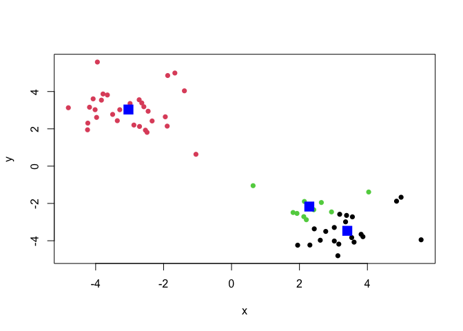

The function for K-means clustering in “base” R is `kmeans()`

``` r
k <- kmeans(x, centers = 2)
k
```

    K-means clustering with 2 clusters of sizes 30, 30

    Cluster means:
              x         y
    1 -3.034707  3.035132
    2  3.035132 -3.034707

    Clustering vector:
     [1] 1 1 1 1 1 1 1 1 1 1 1 1 1 1 1 1 1 1 1 1 1 1 1 1 1 1 1 1 1 1 2 2 2 2 2 2 2 2
    [39] 2 2 2 2 2 2 2 2 2 2 2 2 2 2 2 2 2 2 2 2 2 2

    Within cluster sum of squares by cluster:
    [1] 58.08005 58.08005
     (between_SS / total_SS =  90.5 %)

    Available components:

    [1] "cluster"      "centers"      "totss"        "withinss"     "tot.withinss"
    [6] "betweenss"    "size"         "iter"         "ifault"      

To get the results of the return list object we can use the dollar `$`
syntax.

> Q. How many points are in each cluster?

``` r
k$size
```

    [1] 30 30

> Q. How many points are in each cluster? - cluster
> assignment/membership? - cluster center?

> Q. Make a clustering results figure of the data colored by the cluster
> membership and show cluster centers.

``` r
x <- c(rnorm(30, mean = -3), rnorm(30, mean = 3))
y <- rev(x)
```

``` r
x <- cbind(x,y)
plot(x, col=k$cluster, pch = 16)
points(k$centers, col="blue", pch = 15, cex=2)
```

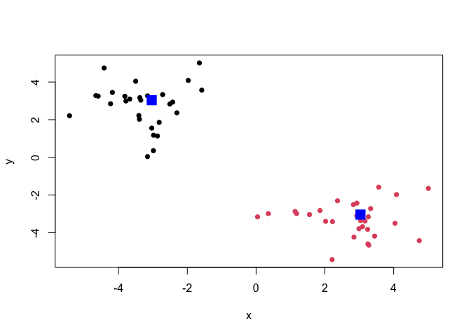

K-means clustering is very popular as it is very fast and relatively
straightforward; it takes numeric data as input and returns the cluster
membership vector etc.

The “issue” is we tell `kmeans()` how many clusters we want!

> Q. Run kmeans again and cluster into 4 groups and plot the results.

``` r
k4 <- kmeans(x, centers =4)
plot(x, col=k4$cluster)
points(k4$centers, pch=15)
```

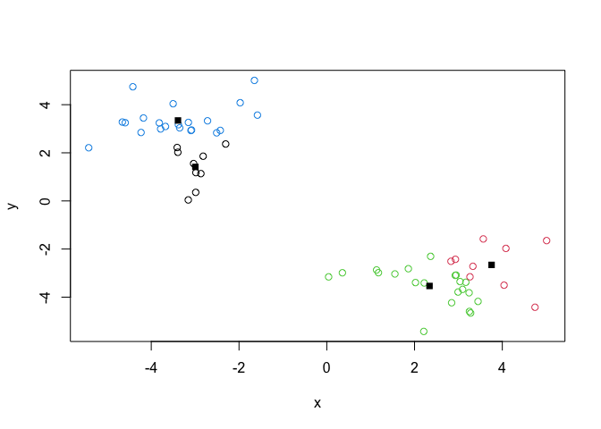

``` r
results <- list()
for (k in 1:5) {
  results[[as.character(k)]] <- kmeans(x, centers = k)
}
for (k in 1:5) {
  plot(x, col = results[[as.character(k)]]$cluster)
  points(results[[as.character(k)]]$centers, pch = 15)
}
```

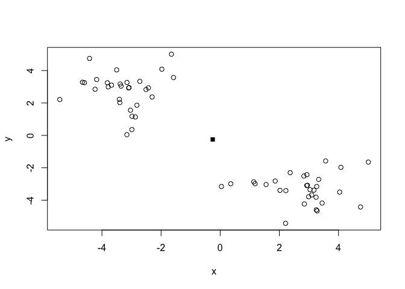

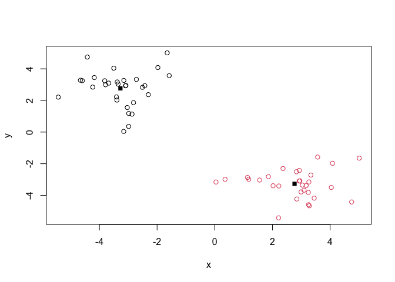

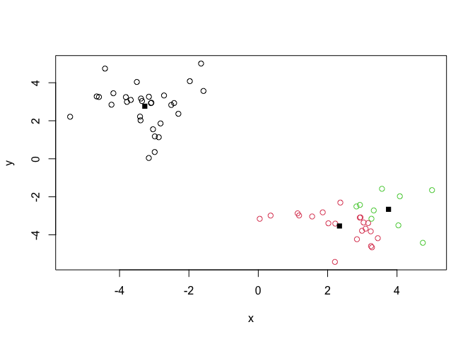

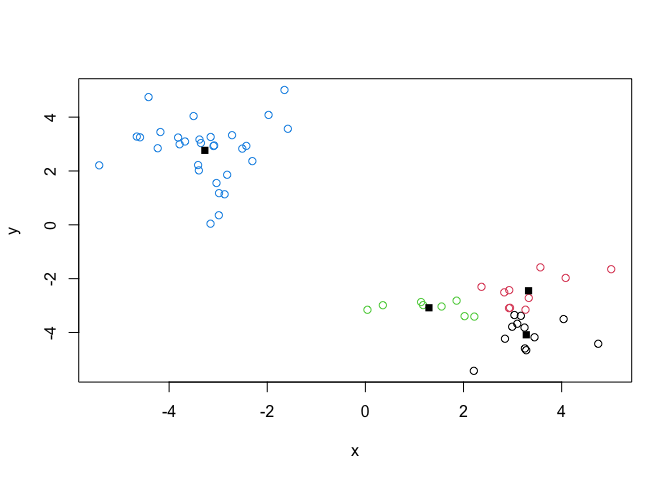

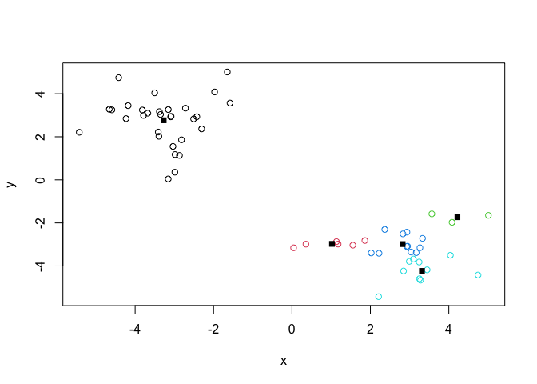

``` r
ss <- sapply(results, function(res) res$tot.withinss)
plot(1:5, ss, type = "b", xlab = "Number of clusters (k)", ylab = "Total within SS")
```

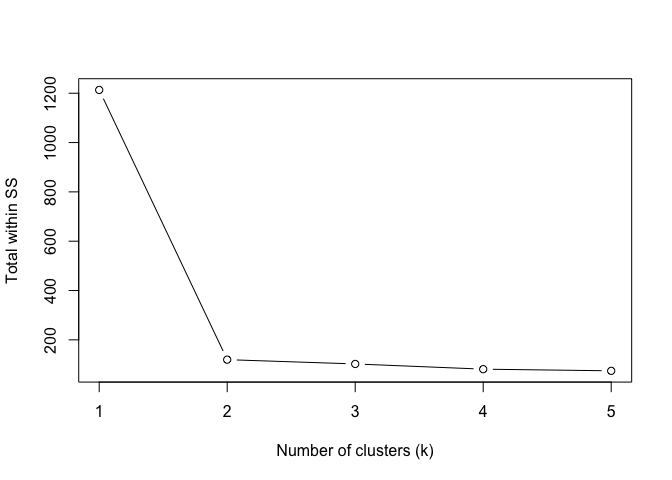

\##Hierarchical CLustering

THe mean “base” R function for Hierarchical Clustering is called
`hclust()`. Here we can’t just input our data we need to first calculate
a distance matrix (e.g. `dist()`) for our data and use this as input to
`hclust()`.

``` r
d <-dist(x)
hc <- hclust(d)
hc
```


    Call:
    hclust(d = d)

    Cluster method   : complete 
    Distance         : euclidean 
    Number of objects: 60 

There is a plot method for hclust results lets try it.

``` r
plot(hc)
abline(h=8, col="red")
```

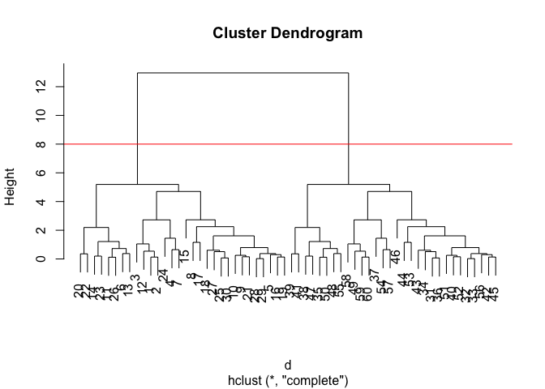

To get our cluster “membership” vector (i.e. our main clustering result)
we can “cut” the tree at a given height or at a height that yields a
given “k” groups.

``` r
grps <- cutree(hc, h=8)
```

> Q. Plot the data with our hclust result coloring.

``` r
plot(x, col = grps)
```


# Principal Component Analysis (PCA)

## PCA of UK Food Data

Import food data from an online CSV file:

``` r
x <- read.csv("~/Downloads/UK_foods.csv")
head(x)
```

                   X England Wales Scotland N.Ireland
    1         Cheese     105   103      103        66
    2  Carcass_meat      245   227      242       267
    3    Other_meat      685   803      750       586
    4           Fish     147   160      122        93
    5 Fats_and_oils      193   235      184       209
    6         Sugars     156   175      147       139

``` r
rownames(x) <-  x[,1]
x <- x[,-1]
x
```

                        England Wales Scotland N.Ireland
    Cheese                  105   103      103        66
    Carcass_meat            245   227      242       267
    Other_meat              685   803      750       586
    Fish                    147   160      122        93
    Fats_and_oils           193   235      184       209
    Sugars                  156   175      147       139
    Fresh_potatoes          720   874      566      1033
    Fresh_Veg               253   265      171       143
    Other_Veg               488   570      418       355
    Processed_potatoes      198   203      220       187
    Processed_Veg           360   365      337       334
    Fresh_fruit            1102  1137      957       674
    Cereals                1472  1582     1462      1494
    Beverages                57    73       53        47
    Soft_drinks            1374  1256     1572      1506
    Alcoholic_drinks        375   475      458       135
    Confectionery            54    64       62        41

``` r
x <- read.csv("~/Downloads/UK_foods.csv", row.names=1)
x
```

                        England Wales Scotland N.Ireland
    Cheese                  105   103      103        66
    Carcass_meat            245   227      242       267
    Other_meat              685   803      750       586
    Fish                    147   160      122        93
    Fats_and_oils           193   235      184       209
    Sugars                  156   175      147       139
    Fresh_potatoes          720   874      566      1033
    Fresh_Veg               253   265      171       143
    Other_Veg               488   570      418       355
    Processed_potatoes      198   203      220       187
    Processed_Veg           360   365      337       334
    Fresh_fruit            1102  1137      957       674
    Cereals                1472  1582     1462      1494
    Beverages                57    73       53        47
    Soft_drinks            1374  1256     1572      1506
    Alcoholic_drinks        375   475      458       135
    Confectionery            54    64       62        41

``` r
barplot(as.matrix(x), beside=T, col=rainbow(nrow(x)))
```


There is one plot that can be useful for small datasets:

``` r
pairs(x, col=rainbow(10), pch=16)
```


> Main point: it can be difficult to spot major trends and patterns even
> in relatively small multivariate database.

\##This is how PCA can help us

The main function in “base” R for PCA is called `prcomp()`

I will take the transpose (`t()`) of our food data so the “foods” are in
the columns:

``` r
PCA <- prcomp(t(x))
summary (PCA)
```

    Importance of components:
                                PC1      PC2      PC3       PC4
    Standard deviation     324.1502 212.7478 73.87622 2.921e-14
    Proportion of Variance   0.6744   0.2905  0.03503 0.000e+00
    Cumulative Proportion    0.6744   0.9650  1.00000 1.000e+00

``` r
PCA$x
```

                     PC1         PC2        PC3           PC4
    England   -144.99315   -2.532999 105.768945 -9.152022e-15
    Wales     -240.52915 -224.646925 -56.475555  5.560040e-13
    Scotland   -91.86934  286.081786 -44.415495 -6.638419e-13
    N.Ireland  477.39164  -58.901862  -4.877895  1.329771e-13

``` r
cols <- c("orange", "red", "blue", "green")
plot(PCA$x[,1], PCA$x[,2], col = cols, pch = 16)
```

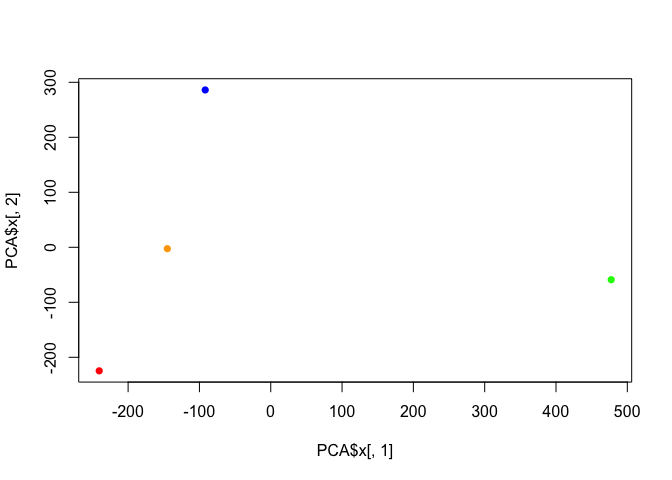

``` r
library(ggplot2)
```

``` r
ggplot(PCA$x) +
  aes(PC1, PC2) +
  geom_point(col=cols)
```


``` r
ggplot(PCA$rotation) +
  aes(PC1, rownames(PCA$rotation)) +
  geom_col()
```

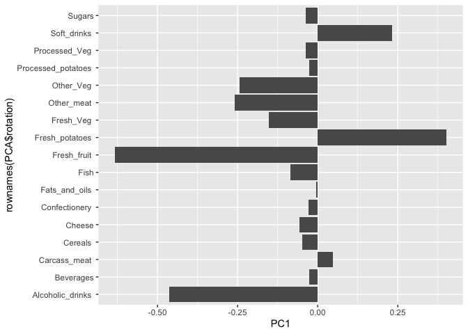

PCA looks very useful for viewing data.
