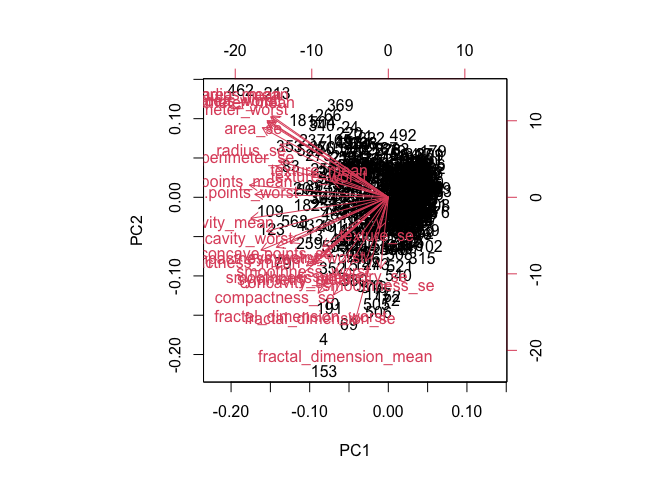
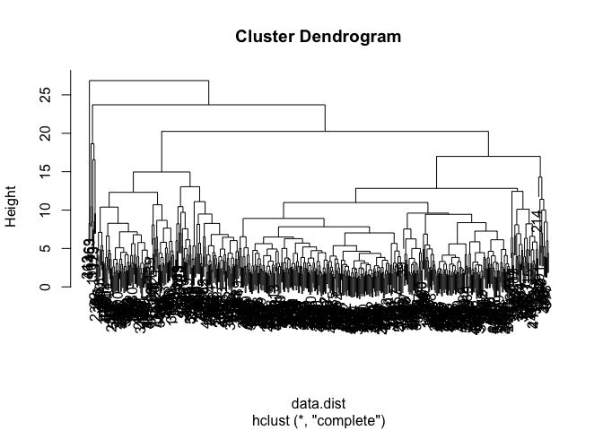
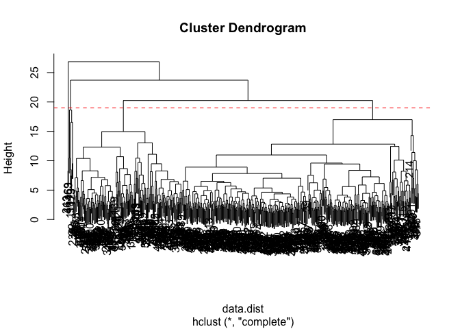
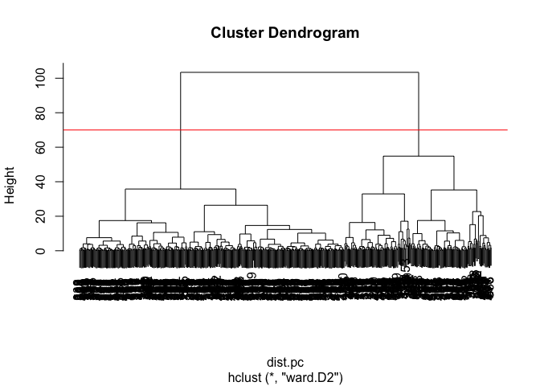

# Class_8_Mini_Project
Dan Vu (PID: A17380158)

- [Background](#background)
- [Data Import](#data-import)
- [Principal Component Analysis
  (PCA)](#principal-component-analysis-pca)
- [Check column means and standard
  deviations](#check-column-means-and-standard-deviations)
  - [Scatter plot observations by components 1 and
    2](#scatter-plot-observations-by-components-1-and-2)
  - [Calculate the variance of each
    component.](#calculate-the-variance-of-each-component)
  - [Hiearchical Clustering](#hiearchical-clustering)
  - [Combining Methods (PCA and
    Clustering)](#combining-methods-pca-and-clustering)
  - [Combining Methods](#combining-methods)
  - [Sensitivity](#sensitivity)
  - [Prediction](#prediction)

## Background

The goal of this mini-project is for you to explore a complete analysis
using the unsupervised learning techniques covered in class. You’ll
extend what you’ve learned by combining PCA as a preprocessing step to
clustering using data that consist of measurements of cell nuclei of
human breast masses. This expands on our RNA-Seq analysis from last day.

The data itself comes from the Wisconsin Breast Cancer Diagnostic Data
Set first reported by K. P. Benne and O. L. Mangasarian: “Robust Linear
Programming Discrimination of Two Linearly Inseparable Sets”.

Values in this data set describe characteristics of the cell nuclei
present in digitized images of a fine needle aspiration (FNA) of a
breast mass

## Data Import

``` r
wisc.df <- read.csv("~/Downloads/WisconsinCancer.csv")
```

``` r
wisc.data <- wisc.df[,-1:-2]
```

``` r
diagnosis <- c(wisc.df$diagnosis)
```

> Q1. How many observations are in this dataset?

``` r
nrow(wisc.data)
```

    [1] 569

> Q2. How many of the observations have a malignant diagnosis?

``` r
n_malignant <- nrow(subset(wisc.data, diagnosis == "M"))
print(n_malignant)
```

    [1] 212

Or we can use a table function.

``` r
table(wisc.df$diagnosis)
```


      B   M 
    357 212 

> Q3. How many variables/features in the data are suffixed with \_mean?

``` r
mean.vars <- grep("_mean$", names(wisc.data), value = TRUE)
n_mean_vars <- length(mean.vars)
print(n_mean_vars)
```

    [1] 10

## Principal Component Analysis (PCA)

The `prcomp()` function to do PCA.

# Check column means and standard deviations

``` r
wisc.pr <- prcomp(wisc.data, scale = TRUE)
summary(wisc.pr)
```

    Importance of components:
                              PC1    PC2     PC3     PC4     PC5     PC6     PC7
    Standard deviation     3.6444 2.3857 1.67867 1.40735 1.28403 1.09880 0.82172
    Proportion of Variance 0.4427 0.1897 0.09393 0.06602 0.05496 0.04025 0.02251
    Cumulative Proportion  0.4427 0.6324 0.72636 0.79239 0.84734 0.88759 0.91010
                               PC8    PC9    PC10   PC11    PC12    PC13    PC14
    Standard deviation     0.69037 0.6457 0.59219 0.5421 0.51104 0.49128 0.39624
    Proportion of Variance 0.01589 0.0139 0.01169 0.0098 0.00871 0.00805 0.00523
    Cumulative Proportion  0.92598 0.9399 0.95157 0.9614 0.97007 0.97812 0.98335
                              PC15    PC16    PC17    PC18    PC19    PC20   PC21
    Standard deviation     0.30681 0.28260 0.24372 0.22939 0.22244 0.17652 0.1731
    Proportion of Variance 0.00314 0.00266 0.00198 0.00175 0.00165 0.00104 0.0010
    Cumulative Proportion  0.98649 0.98915 0.99113 0.99288 0.99453 0.99557 0.9966
                              PC22    PC23   PC24    PC25    PC26    PC27    PC28
    Standard deviation     0.16565 0.15602 0.1344 0.12442 0.09043 0.08307 0.03987
    Proportion of Variance 0.00091 0.00081 0.0006 0.00052 0.00027 0.00023 0.00005
    Cumulative Proportion  0.99749 0.99830 0.9989 0.99942 0.99969 0.99992 0.99997
                              PC29    PC30
    Standard deviation     0.02736 0.01153
    Proportion of Variance 0.00002 0.00000
    Cumulative Proportion  1.00000 1.00000

The main PC result figure is called a “score plot” or a “PC plot” or
“ordination plot”…

``` r
library(ggplot2)

ggplot(wisc.pr$x) +
  aes(PC1, PC2, col = diagnosis) +
  geom_point()
```


> Q4. From your results, what proportion of the original variance is
> captured by the first principal components (PC1)?

0.4427

> Q5. How many principal components (PCs) are required to describe at
> least 70% of the original variance in the data?

3 PCs

> Q6. How many principal components (PCs) are required to describe at
> least 90% of the original variance in the data?

7 PCs

This is a biplot of the data.

``` r
biplot(wisc.pr)
```



> Q7. What stands out to you about this plot? Is it easy or difficult to
> understand? Why?

I can’t see and discern anything that is going on. There is too much
convoluted data to be understandable.

### Scatter plot observations by components 1 and 2

``` r
ggplot(wisc.pr$x) +
  aes(PC1, PC2, col = diagnosis) +
  geom_point()
```


> Q8. Generate a similar plot for principal components 1 and 3. What do
> you notice about these plots?

``` r
ggplot(wisc.pr$x) +
  aes(PC1, PC3, col = diagnosis) +
  geom_point()
```


For the second plot between PC1 and PC3, there is a less discernible
line between the clump of malignant data points and benign data points.

### Calculate the variance of each component.

``` r
pr.var <- wisc.pr$sdev^2
head(pr.var)
```

    [1] 13.281608  5.691355  2.817949  1.980640  1.648731  1.207357

> Q9. For the first principal component, what is the component of the
> loading vector (i.e. wisc.pr\$rotation\[,1\]) for the feature
> concave.points_mean?

``` r
wisc.pr$rotation["concave.points_mean", 1]
```

    [1] -0.2608538

> Q10. What is the minimum number of principal components required to
> explain 80% of the variance of the data?

5 PCs

## Hiearchical Clustering

Just clustering the original data to see if there are any patterns.

``` r
data.scaled <- scale(wisc.data)
data.dist <- dist(data.scaled)
wisc.hclust <- hclust(data.dist)
```

``` r
plot(wisc.hclust)
```



> . Q11. Using the plot() and abline() functions, what is the height at
> which the clustering model has 4 clusters?

``` r
plot(wisc.hclust)
abline(h=19, col="red", lty = 2)
```



Height is 19 when there are 4 clusters.

## Combining Methods (PCA and Clustering)

Clustering the original data was not very productive. Here we combine
both sets of data.

``` r
dist.pc <- dist(wisc.pr$x[,1:3])
wisc.pr.hclust <- hclust(dist.pc, method="ward.D2")
```

View the plot

``` r
plot(wisc.pr.hclust)
abline(h=70, col="red")
```



``` r
grps <- cutree(wisc.hclust, k=4)
table(grps, diagnosis)
```

        diagnosis
    grps   B   M
       1  12 165
       2   2   5
       3 343  40
       4   0   2

How does this clustering grps compare to to the expert diagnoses?

``` r
table(grps, diagnosis)
```

        diagnosis
    grps   B   M
       1  12 165
       2   2   5
       3 343  40
       4   0   2

> Q12. Can you find a better cluster vs diagnoses match by cutting into
> a different number of clusters between 2 and 10?

I’m not too sure, but I believe that cutting the hclust into 5-6
clusters yields more accurate clusters of populations.

``` r
grps <- cutree(wisc.hclust, k=6)
table(grps, diagnosis)
```

        diagnosis
    grps   B   M
       1  12 165
       2   0   5
       3 331  39
       4   2   0
       5  12   1
       6   0   2

> Q13. Which method gives your favorite results for the same data.dist
> dataset? Explain your reasoning.

My favorite method is also the “ward.D2” method because it makes the
clusters and their limits more defined in comparison to one another.

## Combining Methods

``` r
dist.pc2 <- dist(wisc.pr$x[,1:7])
wisc.pr.hclust <- hclust(dist.pc2, method="ward.D2")
```

> Q. How well does the newly created model with four clusters separate
> out the two diagnoses?

The newly created model with 4 clusters separates the two diagnoses
decently but not as well as the actual diagnoses.

``` r
wisc.pr.hclust.clusters <- cutree(wisc.pr.hclust, k=4)
table(wisc.pr.hclust.clusters, diagnosis)
```

                           diagnosis
    wisc.pr.hclust.clusters   B   M
                          1   0  45
                          2   2  77
                          3  26  66
                          4 329  24

> Q16. How well do the k-means and hierarchical clustering models you
> created in previous sections (i.e. before PCA) do in terms of
> separating the diagnoses? Again, use the table() function to compare
> the output of each model (wisc.km\$cluster and wisc.hclust.clusters)
> with the vector containing the actual diagnoses.

``` r
table(wisc.pr.hclust.clusters, diagnosis)
```

                           diagnosis
    wisc.pr.hclust.clusters   B   M
                          1   0  45
                          2   2  77
                          3  26  66
                          4 329  24

I didn’t create the “wisc.km” model because that section was labelled as
optional on the lab report, but the one created with
“wisc.hclust.clusters” shows accuracy when diagnosing malignant cases
but not as much for benign.

## Sensitivity

> Q17. Which of your analysis procedures resulted in a clustering model
> with the best specificity? How about sensitivity?

The combination of both PCA and clustering had the highest sensitivity,
while the just clustering method had the highest specificity.

Sensitivity: TP/(TP+FN) Specificity: TN(TN+FN)

## Prediction

``` r
url <- "https://tinyurl.com/new-samples-CSV"
new <- read.csv(url)
npc <- predict(wisc.pr, newdata=new)
npc
```

               PC1       PC2        PC3        PC4       PC5        PC6        PC7
    [1,]  2.576616 -3.135913  1.3990492 -0.7631950  2.781648 -0.8150185 -0.3959098
    [2,] -4.754928 -3.009033 -0.1660946 -0.6052952 -1.140698 -1.2189945  0.8193031
                PC8       PC9       PC10      PC11      PC12      PC13     PC14
    [1,] -0.2307350 0.1029569 -0.9272861 0.3411457  0.375921 0.1610764 1.187882
    [2,] -0.3307423 0.5281896 -0.4855301 0.7173233 -1.185917 0.5893856 0.303029
              PC15       PC16        PC17        PC18        PC19       PC20
    [1,] 0.3216974 -0.1743616 -0.07875393 -0.11207028 -0.08802955 -0.2495216
    [2,] 0.1299153  0.1448061 -0.40509706  0.06565549  0.25591230 -0.4289500
               PC21       PC22       PC23       PC24        PC25         PC26
    [1,]  0.1228233 0.09358453 0.08347651  0.1223396  0.02124121  0.078884581
    [2,] -0.1224776 0.01732146 0.06316631 -0.2338618 -0.20755948 -0.009833238
                 PC27        PC28         PC29         PC30
    [1,]  0.220199544 -0.02946023 -0.015620933  0.005269029
    [2,] -0.001134152  0.09638361  0.002795349 -0.019015820

``` r
plot(wisc.pr$x[,1:2])
points(npc[,1], npc[,2], col="blue", pch=16, cex=3)
text(npc[,1], npc[,2], c(1,2), col="white")
```


> Q18. Which of these new patients should we prioritize for follow up
> based on your results?

Based on my results, we should prioritize following up Patient 2.

We can use our PCA model to predict new imput patient samples.
