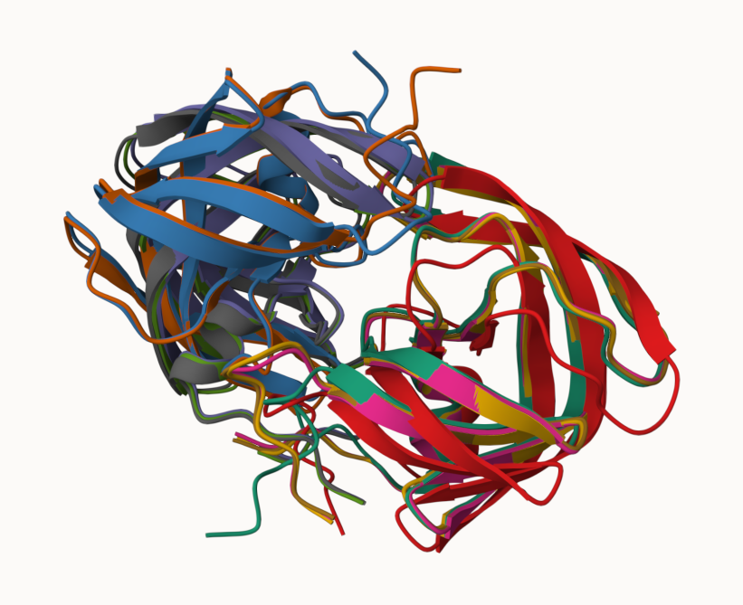
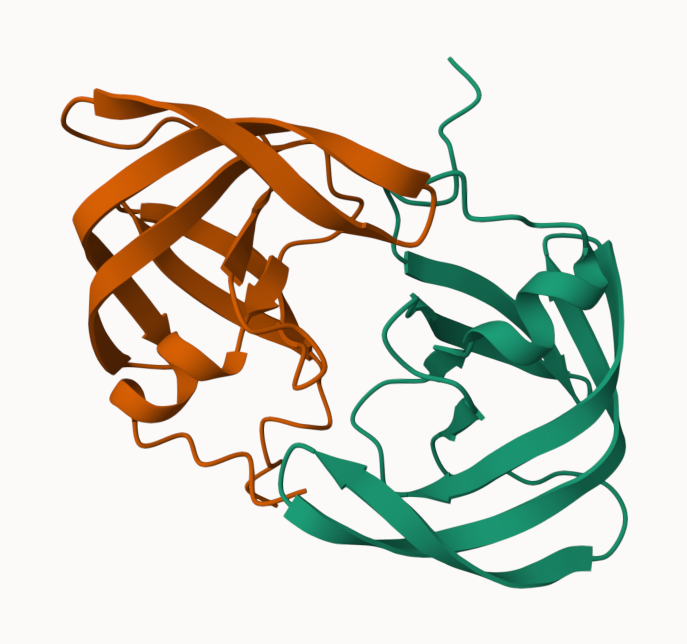
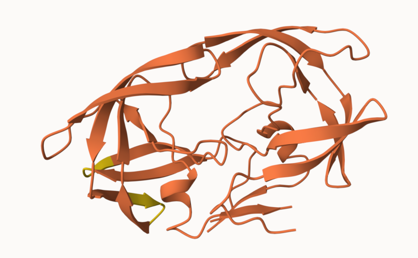
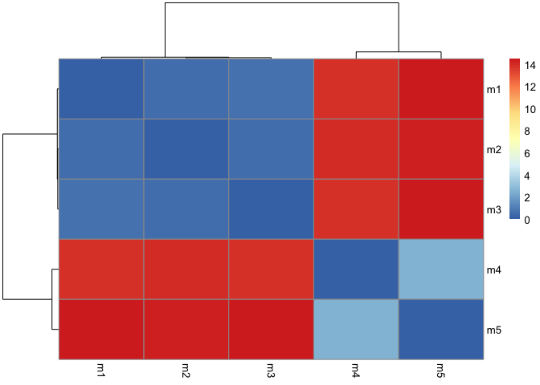
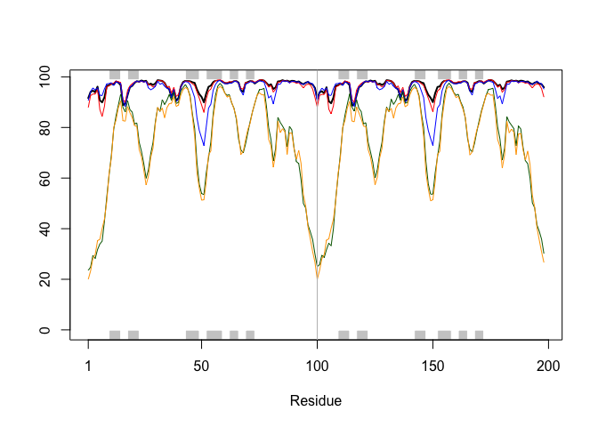
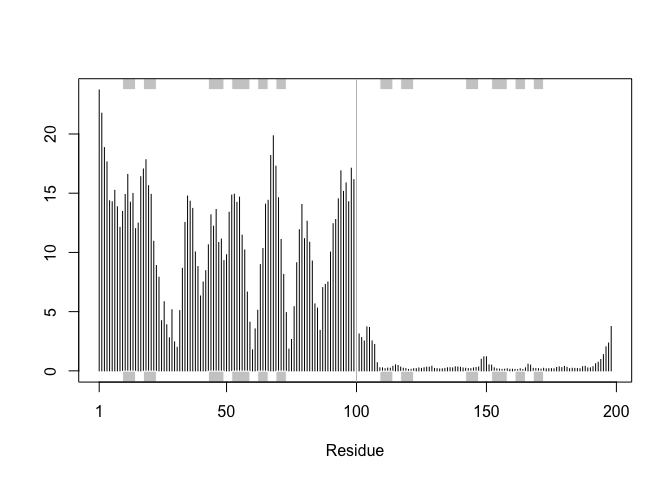
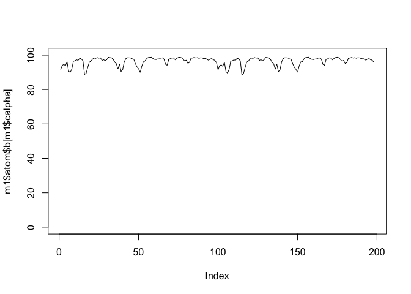
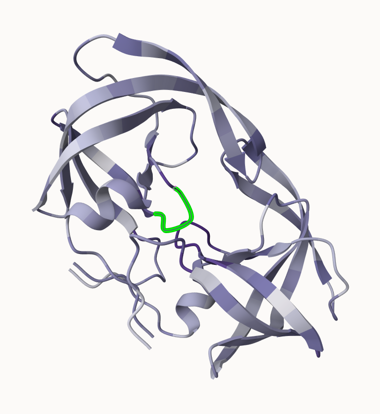

# Class_11
Dan Vu (PID: A17380158)

- [AlphaFold Data Base (AFDB)](#alphafold-data-base-afdb)
- [Generating your own structure
  predictions](#generating-your-own-structure-predictions)
- [Custom analysis of resulting models in
  R](#custom-analysis-of-resulting-models-in-r)
  - [Residue conservation from alignment
    file](#residue-conservation-from-alignment-file)

## AlphaFold Data Base (AFDB)

The EBI maintains the largest database of AlphaFold structure prediction
models at: https://alphafold.ebi.ac.uk

From last class we saw that the PDB had 244,290.

The total number of protein sequences in UniProtKB is 199,579,901.

``` r
244290/199579901 * 100
```

    [1] 0.1224021

Only 0.12 percentage of all protein sequences have a structure.

AFDB is attempting to fill in this gap in knowledge.

There are two types of quality scores in AlphaFold; one for residues
(i.e each amino acid) called PLDDT score. The second PAE score measure
the confidence in the relative position of two residues (i.e a score for
every pair of residues).

## Generating your own structure predictions

Figure of 5 generated HIV-PR models



And the top ranked model colored by chain



And the top ranked model colored by confidence


This is the actual model



# Custom analysis of resulting models in R

Read key result files into R. The first thing I need to know is what my
results directory/foldre is called (i.e. it’s name is different for
every AlphaFold job)

``` r
results.dir <- "HIV_PR_dimer_23119/"

# File names for all PDB models
pdb_files <- list.files(path=results.dir,
                        pattern="*.pdb",
                        full.names = TRUE)

# Print our PDB file names
basename(pdb_files)
```

    [1] "HIV_PR_dimer_23119_unrelaxed_rank_001_alphafold2_multimer_v3_model_4_seed_000.pdb"
    [2] "HIV_PR_dimer_23119_unrelaxed_rank_002_alphafold2_multimer_v3_model_1_seed_000.pdb"
    [3] "HIV_PR_dimer_23119_unrelaxed_rank_003_alphafold2_multimer_v3_model_5_seed_000.pdb"
    [4] "HIV_PR_dimer_23119_unrelaxed_rank_004_alphafold2_multimer_v3_model_2_seed_000.pdb"
    [5] "HIV_PR_dimer_23119_unrelaxed_rank_005_alphafold2_multimer_v3_model_3_seed_000.pdb"

``` r
library(bio3d)

m1 <- read.pdb(pdb_files[1])
pdbs <- pdbaln(pdb_files, fit=TRUE, exefile="msa")
```

    Reading PDB files:
    HIV_PR_dimer_23119//HIV_PR_dimer_23119_unrelaxed_rank_001_alphafold2_multimer_v3_model_4_seed_000.pdb
    HIV_PR_dimer_23119//HIV_PR_dimer_23119_unrelaxed_rank_002_alphafold2_multimer_v3_model_1_seed_000.pdb
    HIV_PR_dimer_23119//HIV_PR_dimer_23119_unrelaxed_rank_003_alphafold2_multimer_v3_model_5_seed_000.pdb
    HIV_PR_dimer_23119//HIV_PR_dimer_23119_unrelaxed_rank_004_alphafold2_multimer_v3_model_2_seed_000.pdb
    HIV_PR_dimer_23119//HIV_PR_dimer_23119_unrelaxed_rank_005_alphafold2_multimer_v3_model_3_seed_000.pdb
    .....

    Extracting sequences

    pdb/seq: 1   name: HIV_PR_dimer_23119//HIV_PR_dimer_23119_unrelaxed_rank_001_alphafold2_multimer_v3_model_4_seed_000.pdb 
    pdb/seq: 2   name: HIV_PR_dimer_23119//HIV_PR_dimer_23119_unrelaxed_rank_002_alphafold2_multimer_v3_model_1_seed_000.pdb 
    pdb/seq: 3   name: HIV_PR_dimer_23119//HIV_PR_dimer_23119_unrelaxed_rank_003_alphafold2_multimer_v3_model_5_seed_000.pdb 
    pdb/seq: 4   name: HIV_PR_dimer_23119//HIV_PR_dimer_23119_unrelaxed_rank_004_alphafold2_multimer_v3_model_2_seed_000.pdb 
    pdb/seq: 5   name: HIV_PR_dimer_23119//HIV_PR_dimer_23119_unrelaxed_rank_005_alphafold2_multimer_v3_model_3_seed_000.pdb 

``` r
rd <- rmsd(pdbs, fit=T)
```

    Warning in rmsd(pdbs, fit = T): No indices provided, using the 198 non NA positions

``` r
range(rd)
```

    [1]  0.000 14.526

``` r
library(pheatmap)

colnames(rd) <- paste0("m",1:5)
rownames(rd) <- paste0("m",1:5)
pheatmap(rd)
```



Now lets plot the pLDDT values across all models. Recall that this
information is in the B-factor column of each model and that this is
stored in our aligned pdbs object as pdbs\$b with a row per
structure/model.

``` r
pdb <- read.pdb("1hsg")
```

      Note: Accessing on-line PDB file

``` r
plotb3(pdbs$b[1,], typ="l", lwd=2, sse=pdb)
points(pdbs$b[2,], typ="l", col="red")
points(pdbs$b[3,], typ="l", col="blue")
points(pdbs$b[4,], typ="l", col="darkgreen")
points(pdbs$b[5,], typ="l", col="orange")
abline(v=100, col="gray")
```



``` r
core <- core.find(pdbs)
```

     core size 197 of 198  vol = 5367.841 
     core size 196 of 198  vol = 4671.097 
     core size 195 of 198  vol = 1819.594 
     core size 194 of 198  vol = 1118.521 
     core size 193 of 198  vol = 1047.988 
     core size 192 of 198  vol = 997.67 
     core size 191 of 198  vol = 952.094 
     core size 190 of 198  vol = 908.824 
     core size 189 of 198  vol = 868.253 
     core size 188 of 198  vol = 835.231 
     core size 187 of 198  vol = 804.274 
     core size 186 of 198  vol = 774.795 
     core size 185 of 198  vol = 751.276 
     core size 184 of 198  vol = 728.023 
     core size 183 of 198  vol = 701.342 
     core size 182 of 198  vol = 681.31 
     core size 181 of 198  vol = 661.848 
     core size 180 of 198  vol = 644.402 
     core size 179 of 198  vol = 610.606 
     core size 178 of 198  vol = 593.697 
     core size 177 of 198  vol = 578.193 
     core size 176 of 198  vol = 563.826 
     core size 175 of 198  vol = 545.052 
     core size 174 of 198  vol = 531.659 
     core size 173 of 198  vol = 502.216 
     core size 172 of 198  vol = 488.28 
     core size 171 of 198  vol = 474.763 
     core size 170 of 198  vol = 458.856 
     core size 169 of 198  vol = 441.214 
     core size 168 of 198  vol = 427.948 
     core size 167 of 198  vol = 418.318 
     core size 166 of 198  vol = 405.661 
     core size 165 of 198  vol = 394.816 
     core size 164 of 198  vol = 381.475 
     core size 163 of 198  vol = 370.923 
     core size 162 of 198  vol = 356.421 
     core size 161 of 198  vol = 344.258 
     core size 160 of 198  vol = 332.311 
     core size 159 of 198  vol = 320.972 
     core size 158 of 198  vol = 308.714 
     core size 157 of 198  vol = 297.817 
     core size 156 of 198  vol = 286.444 
     core size 155 of 198  vol = 277.395 
     core size 154 of 198  vol = 268.366 
     core size 153 of 198  vol = 258.834 
     core size 152 of 198  vol = 248.871 
     core size 151 of 198  vol = 236.132 
     core size 150 of 198  vol = 222.878 
     core size 149 of 198  vol = 211.181 
     core size 148 of 198  vol = 197.496 
     core size 147 of 198  vol = 190.8 
     core size 146 of 198  vol = 183.949 
     core size 145 of 198  vol = 176.845 
     core size 144 of 198  vol = 168.498 
     core size 143 of 198  vol = 161.109 
     core size 142 of 198  vol = 151.241 
     core size 141 of 198  vol = 144.797 
     core size 140 of 198  vol = 138.772 
     core size 139 of 198  vol = 133.15 
     core size 138 of 198  vol = 125.457 
     core size 137 of 198  vol = 118.062 
     core size 136 of 198  vol = 110.467 
     core size 135 of 198  vol = 105.382 
     core size 134 of 198  vol = 99.255 
     core size 133 of 198  vol = 95.295 
     core size 132 of 198  vol = 91.902 
     core size 131 of 198  vol = 88.223 
     core size 130 of 198  vol = 83.595 
     core size 129 of 198  vol = 79.882 
     core size 128 of 198  vol = 76.019 
     core size 127 of 198  vol = 72.229 
     core size 126 of 198  vol = 68.734 
     core size 125 of 198  vol = 65.306 
     core size 124 of 198  vol = 62.542 
     core size 123 of 198  vol = 58.725 
     core size 122 of 198  vol = 54.665 
     core size 121 of 198  vol = 49.975 
     core size 120 of 198  vol = 47.169 
     core size 119 of 198  vol = 43.12 
     core size 118 of 198  vol = 40.037 
     core size 117 of 198  vol = 36.841 
     core size 116 of 198  vol = 34.069 
     core size 115 of 198  vol = 32.146 
     core size 114 of 198  vol = 29.041 
     core size 113 of 198  vol = 26.377 
     core size 112 of 198  vol = 23.828 
     core size 111 of 198  vol = 21.978 
     core size 110 of 198  vol = 20.223 
     core size 109 of 198  vol = 18.766 
     core size 108 of 198  vol = 17.225 
     core size 107 of 198  vol = 15.672 
     core size 106 of 198  vol = 13.934 
     core size 105 of 198  vol = 12.677 
     core size 104 of 198  vol = 11.582 
     core size 103 of 198  vol = 10.284 
     core size 102 of 198  vol = 9.614 
     core size 101 of 198  vol = 7.989 
     core size 100 of 198  vol = 6.988 
     core size 99 of 198  vol = 6.002 
     core size 98 of 198  vol = 5.254 
     core size 97 of 198  vol = 4.6 
     core size 96 of 198  vol = 4.017 
     core size 95 of 198  vol = 3.124 
     core size 94 of 198  vol = 2.833 
     core size 93 of 198  vol = 2.596 
     core size 92 of 198  vol = 2.286 
     core size 91 of 198  vol = 1.772 
     core size 90 of 198  vol = 1.417 
     core size 89 of 198  vol = 1.095 
     core size 88 of 198  vol = 0.899 
     core size 87 of 198  vol = 0.789 
     core size 86 of 198  vol = 0.596 
     core size 85 of 198  vol = 0.461 
     FINISHED: Min vol ( 0.5 ) reached

``` r
core.inds <- print(core, vol=0.5)
```

    # 86 positions (cumulative volume <= 0.5 Angstrom^3) 
      start end length
    1     9  50     42
    2    52  95     44

``` r
xyz <- pdbfit(pdbs, core.inds, outpath="corefit_structures")
```

``` r
rf <- rmsf(xyz)

plotb3(rf, sse=pdb)
abline(v=100, col="gray", ylab="RMSF")
```



``` r
plot(m1$atom$b[m1$calpha], type = "l", ylim=c(0,100))
```



## Residue conservation from alignment file

``` r
aln_file <- list.files(path=results.dir,
                       pattern=".a3m$",
                        full.names = TRUE)
aln_file
```

    [1] "HIV_PR_dimer_23119//HIV_PR_dimer_23119.a3m"

``` r
aln <- read.fasta(aln_file[1], to.upper = TRUE)
```

    [1] " ** Duplicated sequence id's: 101 **"
    [2] " ** Duplicated sequence id's: 101 **"

How many sequences are in this alignment?

``` r
dim(aln$ali)
```

    [1] 5397  132

We can score residue conservation in the alignment with the `conserv()`
function.

``` r
sim <- conserv(aln)

plotb3(sim[1:99], sse=trim.pdb(m1, chain="A"),
       ylab="Conservation Score")
```

    Warning in pdb2sse(sse): No helix and sheet defined in input 'sse' PDB object:
    try using dssp()

    Warning in plotb3(sim[1:99], sse = trim.pdb(m1, chain = "A"), ylab =
    "Conservation Score"): Length of input 'sse' does not equal the length of input
    'x'; Ignoring 'sse'


``` r
con <- consensus(aln, cutoff = 0.9)
con$seq
```

      [1] "-" "-" "-" "-" "-" "-" "-" "-" "-" "-" "-" "-" "-" "-" "-" "-" "-" "-"
     [19] "-" "-" "-" "-" "-" "-" "D" "T" "G" "A" "-" "-" "-" "-" "-" "-" "-" "-"
     [37] "-" "-" "-" "-" "-" "-" "-" "-" "-" "-" "-" "-" "-" "-" "-" "-" "-" "-"
     [55] "-" "-" "-" "-" "-" "-" "-" "-" "-" "-" "-" "-" "-" "-" "-" "-" "-" "-"
     [73] "-" "-" "-" "-" "-" "-" "-" "-" "-" "-" "-" "-" "-" "-" "-" "-" "-" "-"
     [91] "-" "-" "-" "-" "-" "-" "-" "-" "-" "-" "-" "-" "-" "-" "-" "-" "-" "-"
    [109] "-" "-" "-" "-" "-" "-" "-" "-" "-" "-" "-" "-" "-" "-" "-" "-" "-" "-"
    [127] "-" "-" "-" "-" "-" "-"

For a final visualization of these functionally important sites we can
map this conservation score to the Occupancy column of a PDB file for
viewing in molecular viewer programs such as Mol\*, PyMol, VMD, chimera
etc.

``` r
m1.pdb <- read.pdb(pdb_files[1])
occ <- vec2resno(c(sim[1:99], sim[1:99]), m1.pdb$atom$resno)
write.pdb(m1.pdb, o=occ, file="m1_conserv.pdb")
```


